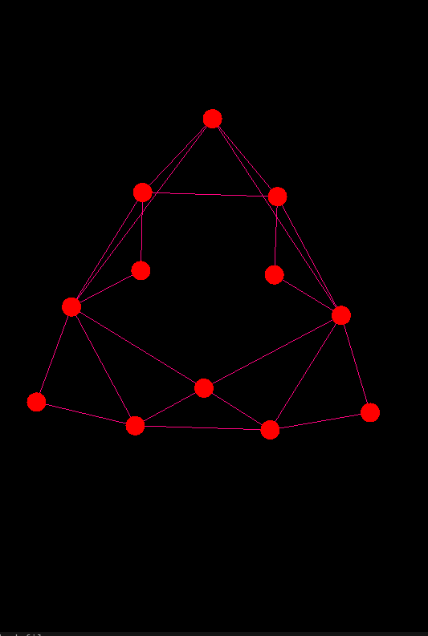

# Dijkstra's Algorithm in a 2D Model

## Introduction
This project implements Dijkstra's algorithm to find the shortest path in a 2D grid. The algorithm efficiently calculates the shortest path from a starting point to a target point, considering obstacles and varying weights.

## Features
- Finds the shortest path in a 2D grid.
- Handles obstacles and varying weights.
- Visual representation of the pathfinding process.

## Installation
To run this project, you need to have a C++ compiler installed. You can use g++ or any other compatible compiler.

1. Clone the repository:
   ```bash
   git clone <https://github.com/TristanBrian/Shortest-path.git>
   cd <Shortest-path>
   ```

2. Compile the code:
   ```bash
   g++ main.cpp -o main -lglut -lGLU -lGL -lSOIL
   ```

## Usage
To run the program, execute the following command:
```bash
./main
```

## Example
Provide an example of how to set up the grid and run the algorithm.



## License
This project is licensed under the MIT License.
